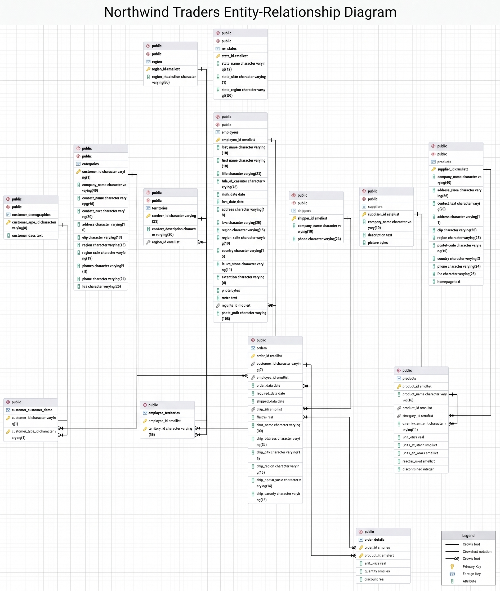

# Práctica SQL: Base de Datos Northwind

**Autor:** Víctor Pérez

##  Entorno de Desarrollo
*   **Motor de base de datos:** PostgreSQL 18
*   **Cliente gráfico:** pgAdmin 4

##  Instrucciones para reproducir el trabajo

Para preparar el entorno y ejecutar las consultas, sigue estos pasos desde pgAdmin 4:

1.  **Creación de la base de datos:** Crea una nueva base de datos llamada `northwind`. En la pestaña de definición, asegúrate de establecer la codificación (`Encoding`) a **UTF8** y seleccionar **template0** como plantilla. Esto evitará errores con caracteres especiales en los datos.
2.  **Conexión correcta:** En el panel izquierdo, selecciona explícitamente la base de datos `northwind` recién creada para asegurar que el entorno de trabajo apunte a ella y no a `postgres`.
3.  **Carga de datos:** Abre la herramienta **Query Tool**, carga el archivo `northwind.sql` proporcionado en la práctica y ejecútalo (F5). Este script limpiará tablas previas, creará la estructura de 14 tablas, insertará los registros y finalmente aplicará las claves primarias y ajenas.

##  Modelo Entidad-Relación (ER)

A continuación se muestra el diagrama desde PostgreSQL que ilustra las relaciones de la base de datos:

## 📑 Índice de Consultas

Las soluciones a las 20 preguntas de negocio requeridas, abarcando desde consultas básicas hasta funciones de ventana, CTEs y pivotado de datos, se encuentran documentadas en el siguiente archivo:

👉 **[Ver las respuestas a los ejercicios (respuestas.md)](respuestas.md)**